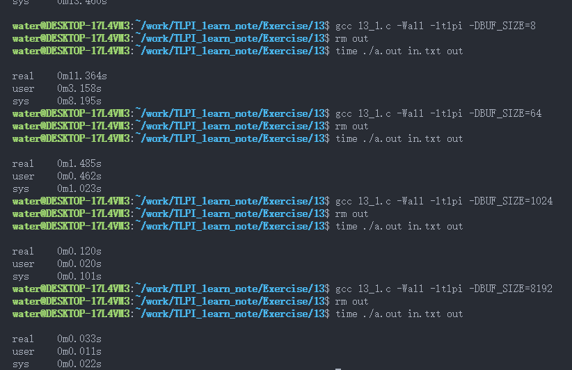
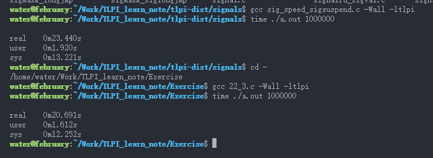

# TLPI_learn_note
《Linux/UNIX系统编程手册》习题答案和部分笔记。
（代码可以从README的超链接或者/Exercise文件夹下对应章节数字找到）

## Index:
+ [环境搭建](#环境搭建)
+ [CH3 系统编程概念](#ch3-系统编程概念)
+ [CH4 文件I/O：通用的I/O模型](#ch4-文件io通用的io模型)
+ [CH5 深入探究文件I/O](#ch5-深入探究文件io)
+ [CH6 进程](#ch6-进程)
+ [CH7 内存分配](#CH7-内存分配)
+ [CH8 用户和组](#ch8-用户和组)
+ [CH9 进程凭证](#ch9-进程凭证)
+ [CH10 时间](#CH10-时间)
+ [CH11 系统限制和选项](#CH11-系统限制和选项)
+ [CH12 系统和进程信息](#CH12-系统和进程信息)
+ [CH13 文件I/O缓冲](#ch13-文件io缓冲)
+ [CH14 文件系统](#CH14-文件系统)
+ [CH15 文件属性](#CH15-文件属性)
+ [CH16 扩展属性](#CH16-扩展属性)
+ [CH17 访问控制列表](#CH17-访问控制列表)
+ [CH18 目录与链接](#CH18-目录与链接)
+ [CH19 监控文件事件](#CH19-监控文件事件)
+ [CH20 信号：基础概念](#CH20-信号基础概念)
+ [CH21 信号：信号处理函数](#CH21-信号信号处理函数)
+ [CH22 信号：高级特性](#CH22-信号高级特性)
+ [CH23 定时器与休眠](#CH23-定时器与休眠)
+ [CH24 进程的创建](#CH24-进程的创建)
+ [CH25 进程的终止](#CH25-进程的终止)
+ [CH26 监控子进程](#CH26-监控子进程)
+ [CH27 程序的执行](#CH27-程序的执行)
+ [CH28 详述进程创建和程序执行](#CH28-详述进程创建和程序执行)
+ [CH29 线程：介绍](#CH29-线程介绍)
+ [CH30 线程：线程同步](#CH30-线程线程同步)
+ [CH31 线程：线程安全和每线程存储](#CH31-线程线程安全和每线程存储)
+ [CH33 线程：更多细节](#CH33-线程更多细节)
+ [CH34 进程组、会话和作业控制](#CH34-进程组、会话和作业控制)
+ [CH43 进程间通信简介](#CH43-进程间通信简介)
+ [CH44 管道和FIFO](#CH44-管道和FIFO)
+ [CH45 System V IPC介绍](#CH45-System-V-IPC-介绍)
+ [CH46 System V 消息队列](#CH46-System-V-消息队列)
+ [CH47 System V 信号量](#CH47-System-V-信号量)
+ [CH48 System V 共享内存](#CH48-System-V-共享内存)
+ [CH49 内存映射](#CH49-内存映射)
+ [CH50 虚拟内存操作](#CH50-虚拟内存操作)
+ [CH52 POSIX消息队列](#CH52-POSIX消息队列)
+ [CH53 POSIX信号量](#CH53-POSIX信号量)
+ [CH54 POSIX共享内存](#CH54-POSIX共享内存)
+ [CH55 文件加锁](#CH55-文件加锁)
+ [CH57 SOCKET: UNIX DOMAIN](#CH57-SOCKET-UNIX-DOMAIN)
+ [CH59 SOCKET: Internet DOMAIN](#CH59-SOCKET-Internet-DOMAIN)
+ [CH60 SOCKET 服务器设计](#CH60-SOCKET-服务器设计)
+ [CH61 SOCKET 高级主题](#CH61-SOCKET-高级主题)
+ [CH62 终端](#CH62-终端)
+ [CH63 其他备选的I/O模型](#CH63-其他备选的I/O模型)
+ [CH64 伪终端](#CH64-伪终端)

## 环境搭建
```
    wget https://man7.org/tlpi/code/download/tlpi-201025-dist.tar.gz
    tar -zxvf tlpi-201025-dist.tar.gz
    cd tlpi-dist/
    make
```

```
    cd lib/
    sudo cp tlpi_hdr.h /usr/local/include/
    sudo cp get_num.h /usr/local/include/
    sudo cp error_functions.h /usr/local/include/
    sudo cp ename.c.inc /usr/local/include/
```

如果没有静态库的话需要手动创建,现在的新版本并不需要这一步，所以这一步不做
```
    g++ -c get_num.c error_functions.c
    ar -crv libtlpi.a get_num.o error_functions.o
    sudo cp libtlpi.a /usr/local/lib
```

运行需要链接libtlpi.a静态库
```
    g++ main.cpp -o main -ltlpi
```
---
<br>
<br>

## CH3 系统编程概念
### [3.1代码](./Exercise/3_1.c)
```
    #include <unistd.h>
    #include <sys/reboot.h>

    int main(){
        reboot(RB_AUTOBOOT);
        return 0;
    }
```
注意使用root权限。RB_AUTOBOOT 是定义在reboot.h头文件中的。如果我们换成RB_POWER_OFF 则系统直接关机。

在其他的Linux中，我们也可以使用如下的程序进行重启。(然而我的Ubuntu 20.04发行版运行不了，只可以上面方式运行，不过这是发行版和具体版本的问题，毕竟书都过了六七年了。)

```
    #include <unistd.h>
    #include <linux/reboot.h>

    int main(){
        reboot(LINUX_REBOOT_MAGIC1, LINUX_REBOOT_MAGIC2A, LINUX_REBOOT_CMD_RESTART, 0);
        return 0;
    }
```
这里的LINUX_REBOOT_MAGIC1、LINUX_REBOOT_MAGIC2A参数在linux/reboot.h中被定义,这些参数是Linux的作者Linus Torvalds自己和他三个女儿的生日。

我又稍微研究了一下，发现warning: implicit declaration of function，linux/reboot.h这个头文件没有声明reboot函数，出于别的考虑吧，再说应该用glibc的reboot比较好吧。写下声明，这样main函数内的调用就能找到reboot函数了。
```
    #include <unistd.h>
    #include <linux/reboot.h>

    int reboot(int);
    int main()
    {
        reboot(LINUX_REBOOT_CMD_RESTART);
        return 0;
    }
```
---
<br>
<br>

## CH4 文件I/O：通用的I/O模型
### [4.1代码](./Exercise/4_1.c)
没什么难度，就是getopt函数学了半天，恼了

### [4.2代码](./Exercise/4_2.c)
有一个问题，就是无法真正的区分源文件中的连续0或是真实的连续空洞。以前的系统中的cp命令类似这样实现的，并没有真正的做到复制空洞。但是现在的(我用的Ubuntu 20.04)已经能处理这种情况，完成正常复制空洞文件了，但是作为练习这种程度已经差不多了，我现在也看不懂源码。。。

---
<br>
<br>

## CH5 深入探究文件I/O
### 勘误
首先说下第五章开头那句所有系统调用都以原子方式执行这句话是是错的，只是大部分完全符合原子性，另外一些需要别的措施来保证同步，还有一些系统调用会被信号中断，还有部分中断的系统调用恢复的情况，不能一概而论。而且原子性需要看语义上下文，可以看这个链接有帮助。
https://www.zhihu.com/question/46552411/answer/130482168

### 5.1
要么在所有头文件前(头文件里可能对这个宏有需要)#define _FILE_OFFSET_BITS 64，要么编译的时候-D_FILE_OFFSET_BITS 64一样的效果，由于电脑本身就是64位，所以看不出效果，如果是32位的系统那么就可以突破文件大小2GB的限制了。

### 5.2
当然会在最后写入咯，因为APPEND之后write当然是先改变偏移量到最后，再写入，当然这是一组原子性的动作。(当然read不受影响)

### 5.3
多个进程同时写同一个文件的情况，如果没有APPEND，那么一个进程刚刚write后但在更新偏移量前，另一个进程可能在当前偏移量写，从而覆盖，造成文件变小。(代码太简单就没写)

### [5.4](./Exercise/5_4.c)
话说APUE也有这道题欸，能用fcntl果然舒服多了，虽然那个是直接用dup貌似更简单。。。

### 5.5
当然共享，太简单不做了。

### 5.6
书上印刷错误，是" world",所以是Gidday world

### [5.7](./Exercise/5_7.c)
1. open文件O_CREAT要用八进制或是直接用宏，我一直用十进制。。。服了我自己了。。。🤮
2. 别再误删了。。。不要直接用vscode在ssh下删除，因为真的找不回，最好alias rm变成移动到某个文件夹，因为误删真的太恐怖了，多commit，不用push
3. 实现倒是很简单，没啥要说的,另外用不用tlpi_hdr.h根本无所谓，我单纯是为了少些几行代码
---
<br>
<br>

## CH6 进程
### 6.1
bss区只记录需要多大的空间，但是并不实际分配空间给它，我ll和du看了，确实占用的空间不关bss的事。<br>
拓展:而数据段是要实际分配空间的，我给全局变量```int a[100000000] = {1}```，虽然只有第一个元素是1，但这个数组也算是初始化了(不过={0}仍然算在bss区，不过这个无所谓啦)，然后ll和du了一些可执行文件，确实变的很大。

### 6.2
```
#include <stdio.h>
#include <setjmp.h>

jmp_buf env;

void func()
{
    longjmp(env, 1);
}

int main()
{
    if (setjmp(env) == 0)
    {
        func();
    }

    return 0;
}
```

### 6.3

[我的简陋实现](./Exercise/6_3.c)

---
<br>
<br>

## CH7 内存分配
### 7.1
可以看见增长幅度挺大的，多次malloc只需执行一次sbrk系统调用，来提高效率，这种思路非常非常常见。(比如vector等等)


### 7.2
这个完全就是CMU15-213的malloc lab，在那个lab中要求你编写一个动态内存申请器（malloc，free，realloc），[我的实现代码](https://github.com/sunhuiquan/csapp_lab/blob/main/malloclab-handout/mm.c)。
我的思路是隐式分离空闲链表，所谓隐式的意思是使用大小来定位前后的块(指针形式叫显式)，分离的意思是有多个有着不同大小范围的链表，每个链表维持着一组在一定范围大小的(2^n-1~2^n)的块，使用2的幂，<<1来快速找到合适的。
合并的思路是看空闲标志位，free的时候也许前后都是空闲，来合并，根据合并后的大小插入合适的链表中。

---
<br>
<br>

## CH8 用户和组
### 8.1
显然这个问题本身错了，作者也在勘误中修改了，因为这里的(long)getpwnam("name")->pw_uid是传递值直接给%ld了，后面的又不会改变这个值。
```
拓展一下：
    当一个函数带有多个参数时，C/C++语言没有规定在函数调用时实参的求值顺序。而编译器根据对代码进行优化的需要自行规定对实参的求值顺序。
    有的编译器规定自左至右，有的编译器规定自右至左，这种对求值顺序的不同规定，对一般参数来讲没有影响。但是，如果实参表达式中带有副作
    用的运算符时，就有可能产生由于求值顺序不同而造成了二义性。
    同样的对于参数有多个函数调用的情况，函数调用的顺序也未定义。
```

我改写一下代码来体先不可重入性。


### 8.2
非常简单，[代码](./Exercise/8_2.c)。

---
<br>
<br>

## CH9 进程凭证
### 9.1
```
   real  effective  saved  fs
a. 1000  0          0      0
b. 1000  2000       2000   2000
c. 1000  2000       0      2000
d. 1000  0          0      2000
e. 1000  2000       3000   2000
```

### 9.2
不具有，因为特权只看有效用户ID(不过因为real是0很容易回到特权模式)

### 9.3
[my_initgroups.c](./Exercise/9_3.c)
```
使用set-root-user-ID，来让程序有权限读取密码文件
gcc 9_3.c -Wall
sudo chown root:water a.out
sudo chmod u+s a.out
```

这个很有意思，因为get和setgroups()函数针对的是调用者ID(即属主即实际的ID)，然后initgroups还会指定用户名，所以说进程的切换也是挺有意思的，不过C风格字符串的操作真是让人头大。

### 9.4
```
int old_eff = geteuid();
（1）
seteuid(getuid()); // 暂时有效切换到实际
seteuid(old_eff);  // 恢复，因为保存UID的值允许
// 注意多种实现完全都可以，另外setuid和getuid完全作用不同

（2）
setreuid(getuid(),getuid())     // 永久放弃，r不是-1(即使值没变)
// 也会修改保存UID变成有效UID(当然是设置完后的新有效UID)
```

### 9.5
```
int old_eff = geteuid();
（1）
seteuid(getuid()); // 暂时有效切换到实际
seteuid(old_eff);  // 恢复，因为保存UID的值允许
//此时setuid不能了，因为是特权用户，会把保存UID也改了，所以最好一直用seteuid好用

（2）
setreuid(getuid(),getuid())     // 永久放弃，r不是-1(即使值没变)
// 也会修改保存UID变成有效UID(当然是设置完后的新有效UID)
```

---
<br>
<br>

## CH10 时间
### 10.1
times的单位是sysconf(_SC_CLK_TCK), (2^32 - x) / sysconf(_SC_CLK_TCK)<br>
clock的单位是CLOCKS_PER_SEC, (2^32 - x) / CLOCKS_PER_SEC

---
<br>
<br>

## CH11 系统限制和选项
### 11.1
孩子只有linux系统(ㄒoㄒ)

### 11.2
ext4 file system:
```
_PC_NAME_MAX, 255
_PC_PATH_MAX, 4096
_PC_PIPE_BUF, 4096
```

---
<br>
<br>

## CH12 系统和进程信息
其实如果不是读取/proc下的文件的话，sysinfo/procfs_pidmax.c是有bug的，因为write的字节数如果少于之前的，那么只是单纯覆盖一部分，而剩下的仍然是原来的值，比如99999写123，变成12399；当然这里并不是bug，因为读取的/proc其实是个伪文件系统，并不是普通的文件。不过这写法真的是让我困扰了好一阵。。。不过这个写法真的恶心人啊。。

### 12.1
[代码](./Exercise/12_1.c)本身不难，但是C的处理字符串和繁杂程度倒是有点恶心，另外量有点多。。。

### 12.2
[代码](./Exercise/12_2.c)在上一问的基础上改了改完成，另外想要做的好看太难了。

### 12.3
[代码](./Exercise/12_3.c)又是在上一问的基础上修修改改，读写目录，读写链接技能get🤮。

---
<br>
<br>

## CH13 文件I/O缓冲

### 13.1
[代码](./Exercise/13/13_1.c)<br>
<br>
使用O_SYNC使得write需要等待内核把数据从高速缓存刷新到磁盘之后才返回,因为实在是太慢了所以直接从缓存大小1024开始了
<br>

### 13.2
简单time测试即可

### 13.3
```
	fflush(fp);
	fsync(fileno(fp));
```
fflush是把fp流对应的stdio缓冲区全部刷新进入内核高速缓存，然后fsync是把fp对应的fd所对应的内核高速缓存(这次fflush放入的+之前放入还没刷新的)刷新到磁盘上；如果没有fflush只有fsync那么只是刷新fp对应的内核高速缓存到磁盘，而fp对应的stdio缓冲区没刷新。

### 13.4
[代码](./Exercise/13/13_4.c)<br>
<br>

```
printf("aaa\n");
write(STDOUT_FILENO,"bbb\n",xxx);
```
(1)未重定向
	printf指向终端是所以stdio缓冲区是行缓冲，而且有\n，那么printf直接刷入内核高速缓存显示，然后write写入内核高速缓冲显示,所以结果是
```
	aaa
	bbb
```
(2)定向到磁盘文件
	printf指向不是终端而是磁盘文件，所以stdio缓冲区是全缓冲，那么printf放到stdio缓冲区，然后write写入内核高速缓冲区显示，这里stdio缓冲区也没满，是return销毁main栈帧后调用exit，这才刷新stdio缓冲区才放到内核高速缓冲的，所以这个顺序的结果是
```
	bbb
	aaa
```

### 13.5
[代码](./Exercise/13/13_5.c) 本来以为要debug好几次的，结果发现写的竟然直接能跑，惊喜<br>
lseek快速定位到文件最后-一个bufsize的位置，读入这一个bufsize，然后倒着顺序遍历检查里面多少个'\n'，不够那么再循环-bufsize，知道lseek定位到对应倒数对应行数开头，(文件位置是属于打开文件描述的属性，所以之后直接write就是从这个位置属性后开始的)，然后write输出即可

---
<br>
<br>

## CH14 文件系统

### 14.1
我只有ext4和tmpfs,tmpfs是/run路径挂载的
```
	more /proc/mounts | grep tmpfs
	发现有 none /run tmpfs rw,nosuid,noexec,noatime,mode=755 0 0
```
[这里是代码](./Exercise/14/14_1.c)

<br>
发现有序建立再有序删除比随机建立再有序删除快<br><br>
<br>
因为是tmpfs是建立再内存上而不是磁盘上的文件系统，所以快非常多，同样符合有序建立再有序删除比随机建立再有序删除快

---
<br>
<br>

## CH15 文件属性

NOTE: 一个比较有意思的关于setuid和seteuid的区别，就是setuid会把保存用户id也设置，这样特权用户就无法恢复了，而seteuid不改变保存用户id可以恢复，对应的组id也是这样

### 15.1
a)只匹配一个，如果用户对应就不管有无权限，不会再检查组和其他的了。
<br>

b)<br>
<br>

c)
```
                         目录     文件
创建文件:                  wx       -
打开读：                   x       r
打开写：                   x       w
删除文件：                 wx        -
重命名：                   wx        -
重命名已存在：              wx       -    （会覆盖）
sticky下特殊就是除了要有权限，还要是属主才行
```

### 15.2
当然不会，因为我们是通过stat获取信息的，包括获取时间信息，如果改了那么就没意义了。

### 15.3
[代码](./Exercise/15/15_3.c)

### 15.4
<br>

[这是代码](./Exercise/15/15_4.c)
简单地暂时把有效改成实际，检测完再改回来即可。

### 15.5
```
mode_t old_mode = umask(0);
umask(old_mode);
```
不过这里中间改变了一次，不具有原子性，可以通过加锁来得到。

### 15.6
[代码](./Exercise/15/15_6.c)

### 15.7
[代码](./Exercise/15/15_7.c)

---
<br>
<br>

## CH16 扩展属性

---
<br>
<br>

## CH17 访问控制列表

---
<br>
<br>

## CH18 目录与链接

### 18.1
可以发现inode是变了的，说明不是修改了正在执行的二进制文件，而是unlink了之前的目录项(当然虽然名称是立即移除了，原进程仍然正常执行，文件是仍然存在的，直到运行结束删除)，然后用了同一个名字(因为刚才刚unlink了所以可以)再建立了一个新的文件而已。

### 18.2
symlink()的第一个参数就是要设置给符号链接的内容，然后解释符号链接文件是以链接的路径为基础的，与当前所在目录无关，所以说这个地址应该是以符号链接文件所在位置为基准的地址。

### 18.3
[代码](./Exercise/18/3/18_3.c)
我才直到fchdir，和openat之类的函数的fd是只能目录fd，没我想的那么智能。。。所以dirname获取目录，然后得到目录fd即可。

### 18.4
[代码](./Exercise/18/4/18_4.c)
无语了，readdir_r已经弃用了，这里只是为了做题用了下。"This function is deprecated; use readdir(3) instead. -- man page"

### 18.5
[代码](./Exercise/18/5/18_5.c)
C的字符串处理和没有STL容器真恶心，不过没想到标准库里实现了strrctr倒序查找。

### 18.6
所谓的先序和后序指分别指的是遇到目录直接处理目录，然后直接进入下一级目录递归处理(这一层不先处理)，处理完最子层之后回到上一层处理，这样；而后序指的是遇到目录则直接进入目录，但先不处理目录，等到下一层全部处理完回到该层的时候再处理目录，这两个都是深度遍历。

### 18.7
[代码](./Exercise/18/5/18_7.c)
需要至少#define _XOPEN_SOURCE 600才有nftw()，另外注意nftw一个目录时，里面的..父目录是不含遍历对象中的(显然父目录也不在目标目录内)，而目录自身是含着的(名字是目录真的名字不是.)。

### 18.8

### 18.9
fchdir()在重复调用的情况下速度快，因为chdir首先需要在用户态和内核态传递数据即路径名字符串，注意这可不是函数传参传个指针这样,首先系统调用要陷入内核态，在内核态是内核页表，显然访问不到用户态的虚拟内存，所以会传递数据(这样的参数传递数据就是拷贝移动，不过对于大量数据传输的情况下，可以内存映射实现内核空间和用户空间的共享内存完成IPC)；另外chdir需要解析路径名得到inode，虽然有高速缓存，但显然也要多做一些工作。<br>
(关于用户态和内核态数据传输，举个最简单的例子，就是write把数据写入内核页缓冲，然后内核才能访问这样要写入磁盘文件的的数据，然后刷新线程之后会刷入磁盘，write就是把用户态的数据(实参数据)传递给了内核(写入内核缓冲区，内核页表))

---
<br>
<br>

## CH19 监控文件事件

---
<br>
<br>

## CH20 信号：基础概念

### 20.1
[代码](./Exercise/20_1.c)注意下不要忘了一定要用那两个函数初始化sa_mask，因为首先自动变量里面是随机值，另外处于实现问题，里面初始化在不同系统实现中可能要求并不是全为0的这种初始化，所以memset和静态初始化都不行，只能调用那两个函数来初始化信号集变量。

### 20.2
[代码](./Exercise/20_2.c)

### 20.3
SA_RESETHAND: [代码](./Exercise/20_3.c)<br>
注意下SA_RESETHAND调用handler前(调用前的意思是改完了还会调用一次handler)改为SIG_DEF，因而只调用一次handler，下一次恢复了SIG_DEF；但是对于SIG_IGN是保持不变，不会改为SIG_DEF

SA_NODEFER: [代码](./Exercise/20_3b.c)<br>
这个是SA_NODEFER使得可以在信号处理函数中递归调用hander自身，执行完返回上一个中断点(在上个调用hander的过程中中断的地方)，恢复执行<br><br>
这是sa_flag=0情况<br>
<br>

原理图：<br>
sa_flag=0情况<br> <br>
SA_NODEFER情况<br> <br>

### 20.4 to do
[代码](./Exercise/20_4.c)

---
<br>
<br>

## CH21 信号：信号处理函数

### 21.1
[代码](./Exercise/21_1.c) 我的实现没有考虑刷新和关闭stdio缓冲区，因为看了别人的实现不知道要不要关STDIN，有点茫然，以后补上。

---
<br>
<br>

## CH22 信号：高级特性

### 22.1
[代码](./Exercise/22_1.c) 注意：只有信号处理函数调用(和终止)才能中断一个系统调用(前提是这个系统调用可以被中断)，其他如ignore、stop、cont不会中断(eg: pause()后kill-STOP和kill-CONT不会中断pause，pause会继续等待被下一个信号中断)

### 22.2
[代码](./Exercise/22_2.c) 标准信号在实时信号前，标准信号顺序非从小到大，实时信号保持从小到大的先后顺序。

### 22.3
[代码](./Exercise/22_3.c)<br>
<br>

### 22.4
[代码](./Exercise/22_4.c) System V signal API 已废止    

---
<br>
<br>

## CH23 定时器与休眠

---
<br>
<br>

## CH24 进程的创建

### 24.1
7个

### 24.2
[代码](./Exercise/24_2.c)

### 24.3

### 24.4
一般先父进程调度，不过这个无法依赖，不同内核版本、不同操作系统的实现都可以是不一样的，而且有可能刚执行父进程有可能就调度了，反而看起来是子进程先行，再强调下无法依赖顺序。

### 24.5

### 拓展
终于明白了exit和从main中return的具体差距，那就是return是先析构main函数的栈，然后再隐式调用exit的，之后exit如果再使用main函数中的栈的内存就会未定义(比如段错误或者内存对应的值和预期不一样)<br><这里举个例子就是return后析构了main的栈帧，然后exit会调用退出处理函数，如果这个函数里面用到了之前析构的栈帧的局部变量就会未定义>；<br>exit直接在main中执行，此时main的栈仍然正常存在，而exit直接完成退出，没有return那一步，因此这里没有摧毁main栈帧；无论哪种形式退出后，最后再由操作系统来回收资源，如果没有return通过改变栈帧相关的寄存器从而释放栈帧，那么这里的os来释放所有资源。

[举例](./Exercise/24_6.c)这里用vfork举下例子，父子进程共享全部内存，这里头包括栈帧，因此子进程return析构了main的栈帧，那么父进程如果return(重新释放一次main的栈帧)，或者使用main中的自动变量都会未定义。
所以一定要注意，vfork的子进程中最好不要使用函数返回return改变父进程的栈帧导致未定义。

---
<br>
<br>

## CH25 进程的终止

### 25.1
[代码](./Exercise/25_1.c)返回255，wait历史原因一直使用16位(返回的status状态只有低16位用到了)，正常返回的情况下只使用高8位，-1的16位是0x1111也是wait返回的status值，但是注意虽然wait内部运算返回是16位的-1值的补码，但status本身类型是int，因此在程序看来决定符号的是第32位,(((status) & 0xff00) >> 8 得到结果是0x11，这是int最高位是32位是0，因此是正数，所以是255


---
<br>
<br>

## CH26 监控子进程

### 26.1
[代码](./Exercise/26_1.c)

### 26.2
父进程被终止变成僵尸进程时子进程被收养。(这是必要的，因为父进程处于僵尸进程的时候是无法wait等待子进程的，如果父进程一直处在僵尸进程，那么子进程就算变成僵尸进程也无法被wait回收，因此当父进程变成僵尸时，子进程就是孤儿进程了，然后被init进程收养，然后init进程定期回收已终止的孤儿进程)
(ps.写的代码git忘提交后误删了，吐了，实现很简单就是sleep打个时间差，然后在不同阶段让子进程打印父进程id即可)

### 26.3
[代码](./Exercise/26_3.c)看了看内部是一个联合union节省不同情况下的结构空间，有点意思，另外si_status是一个宏，难怪vscode没有自动填充，另外这个宏覆盖了我手动写的si_status，导致出错，吐了🤮，代码倒是很简单

### 26.4
sleep确实是不安全的,因为如果在高负载或者特殊情况下，是有可能到了时间另外的进程也没执行完的。(另外就是sleep这个方式实际生产中也根本没用，因为休眠太浪费资源了，时间不好把控，而且还不安全)<br>
[代码](./Exercise/26_4.c)<br>
有点意思的就是通过全局变量标志来忽略其他信号，只有SIGCHLD信号到达才退出循环往下运行。

---
<br>
<br>

## CH27 程序的执行

### 27.1
exclp()调用，xyz中不含有/所以是只查找PATH路径，PATH路径的查找方式是按顺序查找到第一个地方，之后就不查找了，所以这个查找到的是在PATH里面靠前的./dir1/xyz，因为权限没有x，所以无法执行，错误退出
（ps.重点就是PATH中顺序查找，找到第一个就完成了，不会再找第二个）

### 27.2 to do
[代码](./Exercise/27_2.c)

### 27.3
[代码](./Exercise/27_3.c) [脚本](./Exercise/27_3.sh)


### 27.4
与单次fork相比，最大的好处就是产生了一个被init收养自动被回收的进程，这样就可以不用考虑子进程的回收问题了，一些情况下可以大大降低问题的难度。两次fork(父、子、孙进程)通过子进程的退出，使得孙进程被init收养，终止后自动被回收，父进程因为子进程直接退出也不用考虑在一些情况下会变得复杂的wait回收。

### 27.5
printf没有重定向的情况下与终端关联，是行缓存的，所以先缓存到了用户态的stdio缓冲区，后面的execlp是加载新的程序到内存里面，会把当前进程的各种内存给覆盖掉，包括这个用户态的库函数里面的这个stdio缓冲区也被覆盖了，所以之前的缓存区的内容也没了。

### 27.6
[代码](./Exercise/27_6.c)
wait自然会回收终止的僵尸子进程，解除阻塞后pending的SIGCHLD就会让进程接受SIGCHLD信号了。调用system的程序里面阻塞了SIGCHLD来完成正确的子进程回收，之后解除阻塞后调用system的程序会收到之前阻塞的一个SIGCHLD信号(pending没有计数，无论阻塞过程中收到多少，pending只是标志了收到过)，这里需要明确并做好相应的信号处理。


注意：exec执行脚本的参数好奇怪:
```
    对于执行解释器脚本的exec系统调用，自动舍弃argv[0]，而使用的是脚本名作为第三个参数，
    第一第二个分别是解释器的绝对路径(从#!起始行获取)，和起始行(#!这行的参数)，
    这三个参数都是操作系统自动实现的，当exec发现#!就知道这是解释器脚本要用解释器运行了
    如果没#!写明要用的解释器的位置，那么自动使用/bin/sh解释器来解释这个脚本
```

注意：感觉这个好重要，书上怎么只说了子进程终止会发，没说其他情况会不会发。
```
    子进程状态变更了，例如停止、继续、退出等，都会发送SIGCHLD信号通知父进程。
```

---
<br>
<br>

## CH28 详述进程创建和程序执行

---
<br>
<br>

## CH29 线程：介绍

### 29.1
ERROR [EDEADLK/EDEADLOCK Resource deadlock avoided]这是在linux下发生的；当然其他UNIX系统可能会发生死锁（因为pthread_join(pthread_self(),NULL)会阻塞直到等待的线程退出，而这个等待的线程正是它本身。它本身需要执行完pthread_join才可以退出，而pthread_join解除阻塞又需要退出，显然矛盾，发生死锁。）
```
if(!pthread_equal(tid, pthread_self())) // 确保tid不是该线程自己的POSIX thread id
    pthread_join(tid, NULL); // 另外一定是要用pthread_equal来确保可移植性
```

### 29.2
主线程退出后主线程栈的内存之后会被重用，而创建的线程使用的指针指向已经被重用的原主线程栈的内存空间，这种行为未定义，可能造成严重后果

---
<br>
<br>

## CH30 线程：线程同步

### 30.1
[代码](./Exercise/30_1.c)单纯熟练下API，随便写写

### 30.2
[未完成代码](./Exercise/30_2)写楞了，怎么保证线程安全啊。。越想越搞不懂，也没写测试，只是写了写大概思路，等以后再搞一下。

---
<br>
<br>

## CH31 线程：线程安全和每线程存储

### 31.1
[代码](./Exercise/31_1.c)利用互斥量实现pthread_once
    
### 31.2
[代码](./Exercise/31_2)使用线程特有数据，避免了多个线程共享传入的pathname内存导致线程不安全。(由于basenae函数和dirname的代码大体一样，所以就写了一个,不过使用线程局部数据简单代码简单多得多)
简单试了试线程特有数据和线程局部存储这种方式，通过宏的方式都测试了下，写了个Makefile(以后有空再修改下，这个写的太垃圾了，头疼。。)

---
<br>
<br>

## CH33 线程：更多细节

### 33.1
待做，部分前置章节没看完。

### 33.2
不会，因为信号发送目标是进程，而NPTL已经非常接近POSIX标准，因而各线程共享进程ID，因而某一个线程fork产生的子进程，发送SIGCHLD信号目标是父进程ID，而线程共享这个进程ID，因而可能发给该进程下的所有线程。

---
<br>
<br>

## CH34 进程组、会话和作业控制

---
<br>
<br>

## CH36 进程资源
注意:
    RUSAGE_CHILDREN
    Return resource usage statistics for all children of the
    calling process that have terminated and been waited for.
    These statistics will include the resources used by
    grandchildren, and further removed descendants, if all of
    the intervening descendants waited on their terminated
    children.
    manpage上写的多清楚，书上一开始写的有点误导(虽然后面仔细说明了)

### 36.1
<br>
[代码](./Exercise/36_1.c)<br>
可以非常明显地看出子进程的资源使用信息，是在它被父进程wait调用的时候更新的，因而无论是正在运行还是终止都不会记录信息，只有被wait后才有(SIG_IGN处理SIGCHLD也不会有信息)。

### 36.2
[代码](./Exercise/36_2.c)

### 36.3
[代码](./Exercise/36_3.c)<br>
<br>
可以发现超出文件大小软限制的情况下write并没有报错，errno也没有设置出错，但是写入的大小超出RLIMIT_FSIZE的部分被截断舍去。

---
<br>
<br>


## CH43 进程间通信简介

### 43.1
[代码](./Exercise/43_1.c) gettimeofday做差提供高精度的时间差，用于计时挺好用的。

### 43.2
to do

---
<br>
<br>

## CH44 管道和FIFO

### 44.1
[代码](./Exercise/44_1.c) 写了半天，C风格字符串真的恶心，总是不知道有没有必要处理'\0'，吐了。。一不小心把pipe写在fork后面，分别创建了两个管道，我还傻傻查了半天错。。。

### 44.2
[代码](./Exercise/44_2.c) 在库函数里面用了全局变量来处理该等待哪个子进程，static用了

### 44.3
[代码](./Exercise/44_3456/44_3.c) 把代码放到fifo_seqnum_server.c后，make all生成可执行文件。

### 44.4
[代码](./Exercise/44_3456/44_4.c) 复习一下unlink，unlink的作用是立即删除硬链接(文件表项)，并减少inode(文件本身)的引用计数(只有硬链接算，软链接不是)，当inode引用计数为0时真正删除文件本身。但是注意即使引用计数为0，但如果仍有打开文件描述符(本质是通过open系统调用)指向inode项，那么先不删除inode(因为删除inode之后打开描述符就什么也干不了)，这样不会影响已经打开的描述符，直到所有打开描述符关闭后，inode才被删除。(ps. inode(文件本身)的引用计数是硬链接)

另外因为SIGINT和SIGTERM两个信号用了同一个信号处理函数，为了避免一个信号中断调用handler的时候又被另一个信号中断调用同一个handler造成一些困扰，最典型的是造成竞争条件(虽然handler本身要求最好是可重入，这种情况不受影响)，或者因为要退出并做一些清理工作，会造成退出前做了多次清理工作的bug，因此为了避免这个当一个信号中断的时候要把掩码加上别的共用同一个handler的信号。

```
unlink(2) — Linux manual page:
 unlink() deletes a name from the filesystem.  If that name was
       the last link to a file and no processes have the file open, the
       file is deleted and the space it was using is made available for
       reuse.

       If the name was the last link to a file but any processes still
       have the file open, the file will remain in existence until the
       last file descriptor referring to it is closed.

       If the name referred to a symbolic link, the link is removed.

       If the name referred to a socket, FIFO, or device, the name for
       it is removed but processes which have the object open may
       continue to use it. (这种情况下和对普通的file操作没区别)
```

### 44.5
在服务器关闭和重新打开server的FIFO之间,如果client写打开FIFO会错误，导致请求失败。

### 44.6
[代码](./Exercise/44_3456/44_6.c)
[阻塞攻击代码](./Exercise/44_3456/fifo_seqnum_bad_client.c)
 使用轮询，正常情况下即使server在client open FIFO前打开，也会在20000次以内client open FIFO，阻塞攻击的情况下，20000次仍失败则处理下一个请求,通过打印基本可以肯定在20000时几乎没问题,这样超出20000我们认为是攻击会退出后处理下一个请求(可以设大一点因为打开成功后就break实际上不会跑这么多次，对于阻塞攻击多给些时间来确保也是正确的)

### 44.7
[代码](./Exercise/44_7.c) 这个简单，舒服了

note: 只有exit()和从main中return调用退出注册函数，被信号异常终止和_exit()不调用。

---
<br>
<br>

## CH45 System V IPC介绍

### 45.1
[代码](./Exercise/45_1.c) 非常容易，顺便复习下stat写法

### 45_2
[代码](./Exercise/45_2.c) 和练习一没啥区别

### 45_3
首先注意一下如果是IPC_PRIVATE作为key创建的标识符显示是0.
[代码](./Exercise/45_3.c) 公式符合，但是seq字段的行为不同，是因为linux内核升级改变了计算的方式，吐了，我还以为我错了。
发现ipcrm的参数也变了，变了不少。。。

---
<br>
<br>


## CH46 System V 消息队列

注意： A successful close does not guarantee that the data has been
       successfully saved to disk, as the kernel uses the buffer cache
       to defer writes.
       所以说close不保证立即写回磁盘，记得O_SYNC之类的标志。

注意：自定义类型中long之后可能出现字节对齐导致的padding bytes，这种情况下通过offsetof或者整个sizeof - sizeof(long)可以得到真实的剩余部分的所占用空间，在自定义消息类型的mtext的大小十分关键。
[举例](./Exercise/46_0.c)

注意：打开作用的msgget的权限完全可以不写，只是单纯检测是否拥有权限，对后面实际拥有的权限没有任何影响，不过这个检测挺方便的。

注意：发现个有意思的地方，那就是命令行中输入的参数如果是"a"会自动忽略""，要\"转义才不会被shell忽略。

### 46.1
[代码](./Exercise/46_1)

### 46.2
[代码](./Exercise/46_2)

### 46.3
因为有些参数的功能使用的消息类型来确定选择顺序，当然不能用了。

### 46.4
to do(仅完成第一问)

### 46.5
to do

### 46.6
to do

---
<br>
<br>

## CH47 System V 信号量

### 47.1
[代码](./tlpi-dist/svsem/svsem_op.c)

### 47.2
[代码](./Exercise/47/47_2.c)

### 47.3
[代码a](./Exercise/47/47_3a.c)<br>
[代码b](./Exercise/47/47_3b.c)<br>
<br>
可以看出来其实UNDO本质上就是一次取相反值的semop操作，因为进程终止的时候做的撤回操作，同样会改变SEMPID的值。

### 47.4
[代码](./Exercise/47/47_4.c)

### 47.5
[代码](./Exercise/47/47_5)

### 47.6
[代码](./Exercise/47/47_6) fcntl设置FL是文件状态标志，文件描述符标志才是FD而且现在就一个CLOSEXEC这一个

### 47.7
[代码](./Exercise/47/47_7.c) 和System V消息队列基本一样用法，SEM_INFO前两个参数都设成0，因为这是总体的资源限制一个属性，放到arg.__buf，返回是最大正在用的下标；SEM_STAT把信号量集的相关结构放到arg.buf，里面有对应该信号量集的属性，参数是所在下标，返回标识符；从0开始到最大下标遍历，中间可能有不存在EINVAL(因为中途删除了该下标，同时还没来得及被重用的时候)和EACESS(没有读权限(某些操作系统连读权限都不需要))，记得忽略这两个错误，根据SEM_STAT获取相关下标元素的属性来打印。

---
<br>
<br>

## CH48 System V 共享内存

### 48.1
[代码](./Exercise/48/48_1) 没想到tlpi里面有eventFlag和我的头文件名字相同，makefile没写明白一开始用的是他的实现，无语了，虽然结果一样，后来手动链接的。。。我一定以后好好学一些c/c++的链接问题。。。

### 48.2
因为bytes += shmp->cnt这个操作放在了信号量保护的区域之外，而shmp->cnt是被多个进程共享的，如果没有同步保护机制会发生竞争条件。具体来说这里就是当write后释放了写者信号量，如果在更新bytes前调度到另外的进程，更新了shmp->cnt这个共享变量，当再度返回更新bytes时就会使用错误的shmp->cnt的值，出现竞争错误。

### 48.3
[代码](./Exercise/48/48_3)

### 48.4
[代码](./Exercise/48/48_4)

### 48.5
to do

### 48.6
[代码](./Exercise/48/48_6.c) 和之前的System V的消息队列和信号量的操作基本一样，就是别忘了忽略EINVAL和EACESS这两个错误。

---
<br>
<br>

## CH49 内存映射

### 49.1
[代码](./Exercise/49/49_1.c)

### 49.2
[代码](./Exercise/49/49_2)

### 49.3
[代码](./Exercise/49/49_3/test.c) 注意超过全部界限不一定是SIGSEGV，这是未定义的(看你具体访问到哪个地方了)

### 49.4
[代码](./Exercise/49/49_4)

---
<br>
<br>

## CH50 虚拟内存操作

### 50.1
[代码](./Exercise/50/1.c)

### 50.2
[代码](./Exercise/50/2.c)

---
<br>
<br>

## CH52 POSIX消息队列

note: 千万注意要用mq_的系列函数，比如mq_unlink才会删除，而unlink是不会删除的。

note: timespec是秒和纳秒，clock_gettime对应timespec，注意如果是用绝对时间做定时，要把定时的时间加上当前时间。

note: 一个消息队列对象是发送和接受同一种类型的(这样才能正确解析)，所以msgsize可以设置成要发送的消息的大小，同时用attr.msgsize作为receive的参数(必须是大于等于这个的，否则会EMSGSIZE错误，因为可能无法接收可能到来的最大的消息)；不同消息队列的对象可能用的类型不一样，比如server客户发送请求和服务器解析请求，client服务器发送响应，客户接受响应，注意同一个消息队列对象的发送和接受的类型是一样的。

### 52.1
[代码](./Exercise/52/52_1/52_1.c)

### 52.2
[代码](./Exercise/52/52_2)

### 52.3
[代码](./Exercise/52/52_3)

### 52.4
to do

### 52.5
[代码](./Exercise/52/52_5)

### 52.6
[代码](./Exercise/52/52_6)

### 52.7
linux中实现是创建新线程来处理通知，如果一个线程处理完前，多个通知到来，导致多个线程并发处理通知，但由于使用了共享的全局变量buffer，会导致竞争问题。

---
<br>
<br>

## CH53 POSIX信号量

### 53.1
[代码](./Exercise/53/53_1/posix_thread_xfr.c)

### 53.2
[代码](./Exercise/53/53_2) 别忘了删除(unlink或者在/dev/shm删除对应(注意我们的/name会自动转换未sem.name的虚拟文件名))

### 53.3
to do

### 53.4
[代码](./Exercise/53/53_4)
Machine： AliCloud-ECS Linux-Ubuntu 20.04 2G 4cores
thr-num  mutex  ratio posix  ratio systemV
1        0.002  1.5   0.003  39    0.117
4        0.013  8.1   0.105  36    3.826
16       0.079  8.3   0.659  2.4   16.05
可以发现，当线程并发程度增加(冲突的比例上升)的时候，posix和system V信号量的比例在下降，这是因为posix只是在出现冲突的时候调用系统调用，而system V总是调用系统调用，当并发程度上升，posix调用系统调用的比例上升(即轻松的工作比例下降，重活比例上升)，而system V一直是调用系统调用(全是重活的比例)，所以会导致比值下降。

---
<br>
<br>

## CH54 POSIX共享内存

NOTE：注意mmap的读需要用读方式打开，写则要求读写模式打开共享内存段，而ftruncate与访问权限无关。
NOTE：注意ftruncate是对共享内存段操作，所以说shm_open创建的时候初始化共享段大小，之后打开是根本不需要的。
NOTE：有点不适的是对于shm_open关闭是close，而删除又是shm_unlink，虽然我知道这是因为close实现已有，但还是感觉有点乱。(例如xx_unlink不同与unlink哦，普通的unlink删除无效的)

### 54.1
[代码](./Exercise/54_1) 注意mmap的权限是PROT_XX的格式，打开权限是O_XX，文件模式是S_IXX，这些宏的值都不一样，别再搞错了。。。

---
<br>
<br>

## CH55 文件加锁

---
<br>
<br>

## CH57 SOCKET: UNIX DOMAIN

### 57.0
[代码](./Exercise/57/0) 这是我随便试试backlog未决连接的作用。

### 57.1
[代码](./Exercise/57/1) 发送速率大于接受的时候，前面的是直接成功(未决数据报和之前的未决请求类似，由内核保持在未决数据报的队列)，然后阻塞后面的发送，直到队列处理的一堆后再发送一堆(注意不是处理一个发送一个，而是处理一堆未决数据报之后再一次性发送一堆，这点和未决connect不一样,不过很容易理解，为了效率)

### 57.2
[代码](./Exercise/57/2) 使用linux抽象socket名空间非常简单，单纯把地址的path改成第一个是'\0'即可，当然是所有使用该地址的地方都要这样改，不只是bind。

### 57.3
[代码](./Exercise/57/3)

### 57.4
[代码](./Exercise/57/4) 因为socket file(包括linux抽象socket名空间)与socket是一对一的，一个socket只能bind一个socket file，而一个socket file也只能被一个socket绑定，所以会出现 ERROR [EADDRINUSE Address already in use] 错误

---
<br>
<br>

## CH59 SOCKET: Internet DOMAIN

NOTE: 注意下，链接要有.o或者静态库、动态库代码，别犯傻了。
NOTE: vscode的debug本质是gdb套壳，gdb使用一定要有-g提供符号等信息，如果没有-g的话gdb体现是没有各种代码信息，vscode的体现是无法打开函数对应的源文件单步调试，尤其是注意.o/.a/.so的-g也是如此，不然是无法在对应的代码里面单步调试的。
NOTE: 注意下是不是调用的是原本就有的静态、共享库代码，根本就不是自己的，而自己的忘记编译了的弱智错误。。。
NOTE: 若 connect 失败则该套接字不再可用，必须关闭，我们不能对这样的套接字再次调用connect 函数。在每次 connect 失败后，都必须 close 当前套接字描述符并重新调用 socket 。
NOTE: fflush不一定实现刷新输入流，所以用while((c = getchar()) != '\n' && c != EOF)最好

### 59.1
[代码](./Exercise/59/1)

### 59.2
[代码](./Exercise/59/2)

### 59.3
[代码](./Exercise/59/3)

### 59.4
[代码](./Exercise/59/4)

### 59.5
[代码](./Exercise/59/5) 结果是会被忽略，因为a connect b之后，a的对等就是b，internet domain数据报的情况下会丢弃非对等socket发来的数据报

---
<br>
<br>

## CH60 SOCKET: 服务器设计

NOTE: ubuntu没有默认安装inetd，是一个进程监听一个socket服务的，从ps -A可以看出来一堆这样的进程。
NOTE: conf没有服务启用的情况下sudo /etc/init.d/openbsd-inetd start启动不了正常

### 60.1
[代码](./Exercise/60/1) connect会阻塞到accept

### 60.2
[代码](./Exercise/60/2)

---
<br>
<br>

## CH61 SOCKET: 高级主题

---
<br>
<br>

## CH62 终端

---
<br>
<br>

## CH63 其他备选的I/O模型

---
<br>
<br>

## CH64 伪终端

---
<br>
<br>
