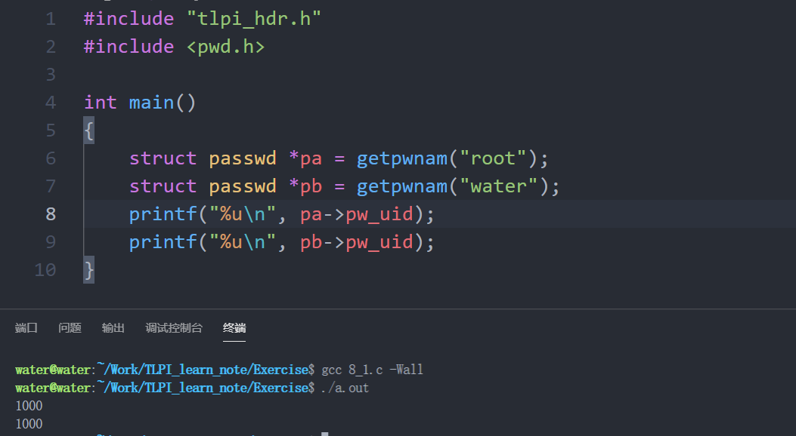
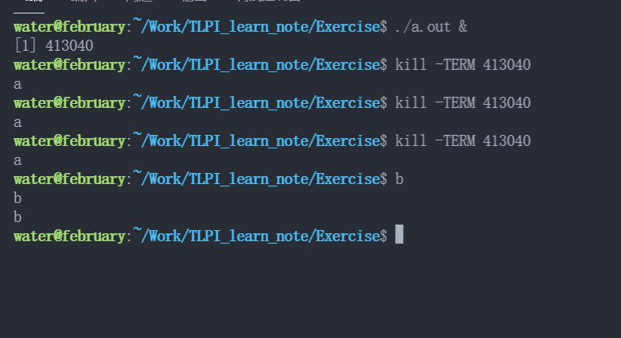
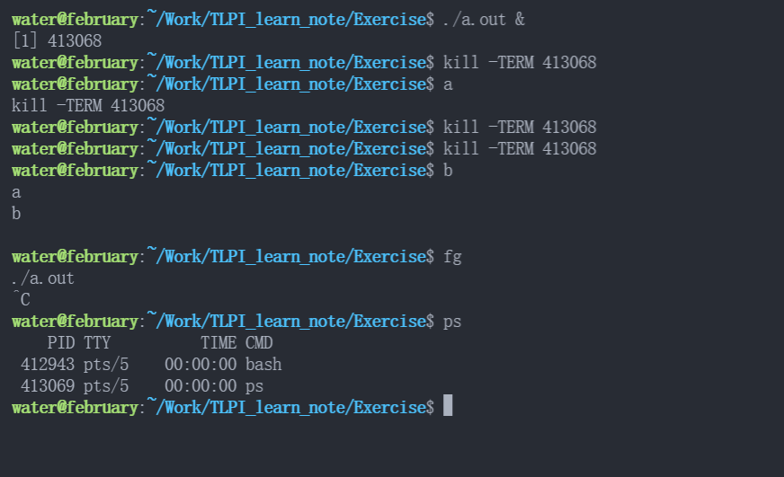

# TLPI_learn_note
《LINUX/LINUX系统编程手册》学习记录和练习习题解答。

## Index:
+ [环境搭建](#环境搭建)
+ [CH3 系统编程概念](#ch3-系统编程概念)
+ [CH4 文件I/O：通用的I/O模型](#ch4-文件io通用的io模型)
+ [CH5 深入探究文件I/O](#ch5-深入探究文件io)
+ [CH6 进程](#ch6-进程)
+ [CH7 内存分配](#CH7-内存分配)
+ [CH8 用户和组](#ch8-用户和组)
+ [CH9 进程凭证](#ch9-进程凭证)
+ [CH10 时间](#CH10-时间)
+ [CH11 系统限制和选项](#CH11-系统限制和选项)
+ [CH12 系统和进程信息](#CH12-系统和进程信息)
+ [CH13 文件I/O缓冲](#CH13-文件I/O缓冲)
+ [CH14 文件系统](#CH14-文件系统)
+ [CH15 文件属性](#CH15-文件属性)
+ [CH16 扩展属性](#CH16-扩展属性)
+ [CH17 访问控制列表](#CH17-访问控制列表)
+ [CH18 目录与链接](#CH18-目录与链接)
+ [CH19 监控文件事件](#CH19-监控文件事件)
+ [CH20 信号：基础概念](#CH20-信号基础概念)
+ [CH21 信号：信号处理函数](#CH21-信号信号处理函数)
+ [CH22 信号：高级特性](#CH22-信号高级特性)
+ [CH23 定时器与休眠](#CH23-定时器与休眠)
+ [CH24 进程的创建](#CH24-进程的创建)
+ [CH25 进程的终止](#CH25-进程的终止)
+ [CH26 监控子进程](#CH26-监控子进程)
+ [CH27 程序的执行](#CH27-程序的执行)
+ [CH28 详述进程创建和程序执行](#CH28-详述进程创建和程序执行)
+ [CH29 线程：介绍](#CH29-线程介绍)
+ [CH30 线程：线程同步](#CH30-线程线程同步)
+ [CH31 线程：线程安全和每线程存储](#CH31-线程线程安全和每线程存储)
+ [CH33 线程：更多细节](#CH33-线程更多细节)


## 环境搭建
```
    wget https://man7.org/tlpi/code/download/tlpi-201025-dist.tar.gz
    tar -zxvf tlpi-201025-dist.tar.gz
    cd tlpi-dist/
    make
```

```
    cd lib/
    sudo cp tlpi_hdr.h /usr/local/include/
    sudo cp get_num.h /usr/local/include/
    sudo cp error_functions.h /usr/local/include/
    sudo cp ename.c.inc /usr/local/include/
```

如果没有静态库的话需要手动创建,现在的新版本并不需要这一步，所以这一步不做
```
    g++ -c get_num.c error_functions.c
    ar -crv libtlpi.a get_num.o error_functions.o
    sudo cp libtlpi.a /usr/local/lib
```

运行需要链接libtlpi.a静态库
```
    g++ main.cpp -o main -ltlpi
```
---
<br>
<br>

## CH3 系统编程概念
### [3.1代码](./Exercise/3_1.c)
```
    #include <unistd.h>
    #include <sys/reboot.h>

    int main(){
        reboot(RB_AUTOBOOT);
        return 0;
    }
```
注意使用root权限。RB_AUTOBOOT 是定义在reboot.h头文件中的。如果我们换成RB_POWER_OFF 则系统直接关机。

在其他的Linux中，我们也可以使用如下的程序进行重启。(然而我的Ubuntu 20.04发行版运行不了，只可以上面方式运行，不过这是发行版和具体版本的问题，毕竟书都过了六七年了。)

```
    #include <unistd.h>
    #include <linux/reboot.h>

    int main(){
        reboot(LINUX_REBOOT_MAGIC1, LINUX_REBOOT_MAGIC2A, LINUX_REBOOT_CMD_RESTART, 0);
        return 0;
    }
```
这里的LINUX_REBOOT_MAGIC1、LINUX_REBOOT_MAGIC2A参数在linux/reboot.h中被定义,这些参数是Linux的作者Linus Torvalds自己和他三个女儿的生日。

我又稍微研究了一下，发现warning: implicit declaration of function，linux/reboot.h这个头文件没有声明reboot函数，出于别的考虑吧，再说应该用glibc的reboot比较好吧。写下声明，这样main函数内的调用就能找到reboot函数了。
```
    #include <unistd.h>
    #include <linux/reboot.h>

    int reboot(int);
    int main()
    {
        reboot(LINUX_REBOOT_CMD_RESTART);
        return 0;
    }
```
---
<br>
<br>

## CH4 文件I/O：通用的I/O模型
### [4.1代码](./Exercise/4_1.c)
没什么难度，就是getopt函数学了半天，恼了

### [4.2代码](./Exercise/4_2.c)
有一个问题，就是无法真正的区分源文件中的连续0或是真实的连续空洞。以前的系统中的cp命令类似这样实现的，并没有真正的做到复制空洞。但是现在的(我用的Ubuntu 20.04)已经能处理这种情况，完成正常复制空洞文件了，但是作为练习这种程度已经差不多了，我现在也看不懂源码。。。

---
<br>
<br>

## CH5 深入探究文件I/O
### 勘误
首先说下第五章开头那句所有系统调用都以原子方式执行这句话是是错的，只是大部分完全符合原子性，另外一些需要别的措施来保证同步，还有一些系统调用会被信号中断，还有部分中断的系统调用恢复的情况，不能一概而论。而且原子性需要看语义上下文，可以看这个链接有帮助。
https://www.zhihu.com/question/46552411/answer/130482168

### 5.1
要么在所有头文件前(头文件里可能对这个宏有需要)#define _FILE_OFFSET_BITS 64，要么编译的时候-D_FILE_OFFSET_BITS 64一样的效果，由于电脑本身就是64位，所以看不出效果，如果是32位的系统那么就可以突破文件大小2GB的限制了。

### 5.2
当然会在最后写入咯，因为APPEND之后write当然是先改变偏移量到最后，再写入，当然这是一组原子性的动作。(当然read不受影响)

### 5.3
多个进程同时写同一个文件的情况，如果没有APPEND，那么一个进程刚刚write后但在更新偏移量前，另一个进程可能在当前偏移量写，从而覆盖，造成文件变小。(代码太简单就没写)

### [5.4](./Exercise/5_4.c)
话说APUE也有这道题欸，能用fcntl果然舒服多了，虽然那个是直接用dup貌似更简单。。。

### 5.5
当然共享，太简单不做了。

### 5.6
书上印刷错误，是" world",所以是Gidday world

### [5.7](./Exercise/5_7.c)
1. open文件O_CREAT要用八进制或是直接用宏，我一直用十进制。。。服了我自己了。。。🤮
2. 别再误删了。。。不要直接用vscode在ssh下删除，因为真的找不回，最好alias rm变成移动到某个文件夹，因为误删真的太恐怖了，多commit，不用push
3. 实现倒是很简单，没啥要说的,另外用不用tlpi_hdr.h根本无所谓，我单纯是为了少些几行代码
---
<br>
<br>

## CH6 进程
### 6.1
bss区只记录需要多大的空间，但是并不实际分配空间给它，我ll和du看了，确实占用的空间不关bss的事。<br>
拓展:而数据段是要实际分配空间的，我给全局变量```int a[100000000] = {1}```，虽然只有第一个元素是1，但这个数组也算是初始化了(不过={0}仍然算在bss区，不过这个无所谓啦)，然后ll和du了一些可执行文件，确实变的很大。

### 6.2
```
#include <stdio.h>
#include <setjmp.h>

jmp_buf env;

void func()
{
    longjmp(env, 1);
}

int main()
{
    if (setjmp(env) == 0)
    {
        func();
    }

    return 0;
}
```

### 6.3
[我的简陋实现](./Exercise/6_3.c)
---
<br>
<br>

## CH7 内存分配
### 7.1
可以看见增长幅度挺大的，多次malloc只需执行一次sbrk系统调用，来提高效率，这种思路非常非常常见。(比如vector等等)


### 7.2
这个完全就是CMU15-213的malloc lab，在那个lab中要求你编写一个动态内存申请器（malloc，free，realloc），[我的实现代码](https://github.com/sunhuiquan/csapp_lab/blob/main/malloclab-handout/mm.c)。
我的思路是隐式分离空闲链表，所谓隐式的意思是使用大小来定位前后的块(指针形式叫显式)，分离的意思是有多个有着不同大小范围的链表，每个链表维持着一组在一定范围大小的(2^n-1~2^n)的块，使用2的幂，<<1来快速找到合适的。
合并的思路是看空闲标志位，free的时候也许前后都是空闲，来合并，根据合并后的大小插入合适的链表中。

---
<br>
<br>

## CH8 用户和组
### 8.1
显然这个问题本身错了，作者也在勘误中修改了，因为这里的(long)getpwnam("name")->pw_uid是传递值直接给%ld了，后面的又不会改变这个值。
```
拓展一下：
    当一个函数带有多个参数时，C/C++语言没有规定在函数调用时实参的求值顺序。而编译器根据对代码进行优化的需要自行规定对实参的求值顺序。
    有的编译器规定自左至右，有的编译器规定自右至左，这种对求值顺序的不同规定，对一般参数来讲没有影响。但是，如果实参表达式中带有副作
    用的运算符时，就有可能产生由于求值顺序不同而造成了二义性。
    同样的对于参数有多个函数调用的情况，函数调用的顺序也未定义。
```

我改写一下代码来体先不可重入性。


### 8.2
非常简单，[代码](./Exercise/8_2.c)。

---
<br>
<br>

## CH9 进程凭证
### 9.1
```
   real  effective  saved  fs
a. 1000  0          0      0
b. 1000  2000       2000   2000
c. 1000  2000       0      2000
d. 1000  0          0      2000
e. 1000  2000       3000   2000
```

### 9.2
不具有，因为特权只看有效用户ID(不过因为real是0很容易回到特权模式)

### 9.3
[my_initgroups.c](./Exercise/9_3.c)
```
使用set-root-user-ID，来让程序有权限读取密码文件
gcc 9_3.c -Wall
sudo chown root:water a.out
sudo chmod u+s a.out
```

这个很有意思，因为get和setgroups()函数针对的是调用者ID(即属主即实际的ID)，然后initgroups还会指定用户名，所以说进程的切换也是挺有意思的，不过C风格字符串的操作真是让人头大。

### 9.4
```
int old_eff = geteuid();
（1）
seteuid(getuid()); // 暂时有效切换到实际
seteuid(old_eff);  // 恢复，因为保存UID的值允许
// 注意多种实现完全都可以，另外setuid和getuid完全作用不同

（2）
setreuid(getuid(),getuid())     // 永久放弃，r不是-1(即使值没变)
// 也会修改保存UID变成有效UID(当然是设置完后的新有效UID)
```

### 9.5
```
int old_eff = geteuid();
（1）
seteuid(getuid()); // 暂时有效切换到实际
seteuid(old_eff);  // 恢复，因为保存UID的值允许
//此时setuid不能了，因为是特权用户，会把保存UID也改了，所以最好一直用seteuid好用

（2）
setreuid(getuid(),getuid())     // 永久放弃，r不是-1(即使值没变)
// 也会修改保存UID变成有效UID(当然是设置完后的新有效UID)
```

---
<br>
<br>

## CH10 时间
### 10.1
times的单位是sysconf(_SC_CLK_TCK), (2^32 - x) / sysconf(_SC_CLK_TCK)<br>
clock的单位是CLOCKS_PER_SEC, (2^32 - x) / CLOCKS_PER_SEC

---
<br>
<br>

## CH11 系统限制和选项
### 11.1
孩子只有linux系统(ㄒoㄒ)

### 11.2
ext4 file system:
```
_PC_NAME_MAX, 255
_PC_PATH_MAX, 4096
_PC_PIPE_BUF, 4096
```

---
<br>
<br>

## CH12 系统和进程信息
其实如果不是读取/proc下的文件的话，sysinfo/procfs_pidmax.c是有bug的，因为write的字节数如果少于之前的，那么只是单纯覆盖一部分，而剩下的仍然是原来的值，比如99999写123，变成12399；当然这里并不是bug，因为读取的/proc其实是个伪文件系统，并不是普通的文件。不过这写法真的是让我困扰了好一阵。。。不过这个写法真的恶心人啊。。

### 12.1
[代码](./Exercise/12_1.c)本身不难，但是C的处理字符串和繁杂程度倒是有点恶心，另外量有点多。。。

### 12.2
[代码](./Exercise/12_2.c)在上一问的基础上改了改完成，另外想要做的好看太难了。

### 12.3
[代码](./Exercise/12_3.c)又是在上一问的基础上修修改改，读写目录，读写链接技能get🤮。

---
<br>
<br>

## CH13 文件I/O缓冲

---
<br>
<br>

## CH14 文件系统

---
<br>
<br>

## CH15 文件属性

---
<br>
<br>

## CH16 扩展属性

---
<br>
<br>

## CH17 访问控制列表

---
<br>
<br>

## CH18 目录与链接

---
<br>
<br>

## CH19 监控文件事件

---
<br>
<br>

## CH20 信号：基础概念

### 20.1
[代码](./Exercise/20_1.c)注意下不要忘了一定要用那两个函数初始化sa_mask，因为首先自动变量里面是随机值，另外处于实现问题，里面初始化在不同系统实现中可能要求并不是全为0的这种初始化，所以memset和静态初始化都不行，只能调用那两个函数来初始化信号集变量。

### 20.2
[代码](./Exercise/20_2.c)

### 20.3
SA_RESETHAND: [代码](./Exercise/20_3.c)<br>
注意下SA_RESETHAND调用handler前(调用前的意思是改完了还会调用一次handler)改为SIG_DEF，因而只调用一次handler，下一次恢复了SIG_DEF；但是对于SIG_IGN是保持不变，不会改为SIG_DEF

SA_NODEFER: [代码](./Exercise/20_3b.c)<br>
这个是SA_NODEFER使得可以在信号处理函数中递归调用hander自身，执行完返回上一个中断点(在上个调用hander的过程中中断的地方)，恢复执行<br><br>
这是sa_flag=0情况<br>
<br>

原理图：<br>
sa_flag=0情况<br> <br>
SA_NODEFER情况<br> <br>

### 20.4 to do
[代码](./Exercise/20_4.c)

---
<br>
<br>

## CH21 信号：信号处理函数

---
<br>
<br>

## CH22 信号：高级特性

---
<br>
<br>

## CH23 定时器与休眠

---
<br>
<br>

## CH24 进程的创建

### 24.1
7个

### 24.2
[代码](./Exercise/24_2.c)

### 24.3

### 24.4
一般先父进程调度，不过这个无法依赖，不同内核版本、不同操作系统的实现都可以是不一样的，而且有可能刚执行父进程有可能就调度了，反而看起来是子进程先行，再强调下无法依赖顺序。

### 24.5

### 拓展
终于明白了exit和从main中return的具体差距，那就是return是先析构main函数的栈，然后再隐式调用exit的，之后exit如果再使用main函数中的栈的内存就会未定义(比如段错误或者内存对应的值和预期不一样)，这里的再使用比如exit后执行的那些退出注册函数；而exit直接在main中执行，此时main的栈仍然正常存在，而exit直接完成退出，没有return那一步，因此这里没有摧毁main栈帧；无论哪种形式退出后，最后再由操作系统来回收资源，如果没有return通过改变栈帧相关的寄存器从而释放栈帧，那么这里的os来释放所有资源。

[举例](./Exercise/24_6.c)这里用vfork举下例子，父子进程共享全部内存，这里头包括栈帧，因此子进程return析构了main的栈帧，那么父进程如果return(重新释放一次main的栈帧)，或者使用main中的自动变量都会未定义。
所以一定要注意，vfork的子进程中最好不要使用函数返回return改变父进程的栈帧导致未定义。

---
<br>
<br>

## CH25 进程的终止

### 25.1
[代码](./Exercise/25_1.c)返回255，wait历史原因一直使用16位(返回的status状态只有低16位用到了)，正常返回的情况下只使用高8位，-1的16位是0x1111也是wait返回的status值，但是注意虽然wait内部运算返回是16位的-1值的补码，但status本身类型是int，因此在程序看来决定符号的是第32位,(((status) & 0xff00) >> 8 得到结果是0x11，这是int最高位是32位是0，因此是正数，所以是255


---
<br>
<br>

## CH26 监控子进程

### 26.1
[代码](./Exercise/26_1.c)

### 26.2
父进程被终止变成僵尸进程时子进程被收养。(这是必要的，因为父进程处于僵尸进程的时候是无法wait等待子进程的，如果父进程一直处在僵尸进程，那么子进程就算变成僵尸进程也无法被wait回收，因此当父进程变成僵尸时，子进程就是孤儿进程了，然后被init进程收养，然后init进程定期回收已终止的孤儿进程)
(ps.写的代码git忘提交后误删了，吐了，实现很简单就是sleep打个时间差，然后在不同阶段让子进程打印父进程id即可)

### 26.3
[代码](./Exercise/26_3.c)看了看内部是一个联合union节省不同情况下的结构空间，有点意思，另外si_status是一个宏，难怪vscode没有自动填充，另外这个宏覆盖了我手动写的si_status，导致出错，吐了🤮，代码倒是很简单

### 26.4
sleep确实是不安全的,因为如果在高负载或者特殊情况下，是有可能到了时间另外的进程也没执行完的。(另外就是sleep这个方式实际生产中也根本没用，因为休眠太浪费资源了，时间不好把控，而且还不安全)<br>
[代码](./Exercise/26_4.c)<br>
有点意思的就是通过全局变量标志来忽略其他信号，只有SIGCHLD信号到达才退出循环往下运行。

---
<br>
<br>

## CH27 程序的执行

### 27.1
exclp()调用，xyz中不含有/所以是只查找PATH路径，PATH路径的查找方式是按顺序查找到第一个地方，之后就不查找了，所以这个查找到的是在PATH里面靠前的./dir1/xyz，因为权限没有x，所以无法执行，错误退出
（ps.重点就是PATH中顺序查找，找到第一个就完成了，不会再找第二个）

### 27.2 to do
[代码](./Exercise/27_2.c)

### 27.3
[代码](./Exercise/27_3.c) [脚本](./Exercise/27_3.sh)


### 27.4
与单次fork相比，最大的好处就是产生了一个被init收养自动被回收的进程，这样就可以不用考虑子进程的回收问题了，一些情况下可以大大降低问题的难度。两次fork(父、子、孙进程)通过子进程的退出，使得孙进程被init收养，终止后自动被回收，父进程因为子进程直接退出也不用考虑在一些情况下会变得复杂的wait回收。

### 27.5
printf没有重定向的情况下与终端关联，是行缓存的，所以先缓存到了用户态的stdio缓冲区，后面的execlp是加载新的程序到内存里面，会把当前进程的各种内存给覆盖掉，包括这个用户态的库函数里面的这个stdio缓冲区也被覆盖了，所以之前的缓存区的内容也没了。

### 27.6
[代码](./Exercise/27_6.c)
wait自然会回收终止的僵尸子进程，解除阻塞后pending的SIGCHLD就会让进程接受SIGCHLD信号了。调用system的程序里面阻塞了SIGCHLD来完成正确的子进程回收，之后解除阻塞后调用system的程序会收到之前阻塞的一个SIGCHLD信号(pending没有计数，无论阻塞过程中收到多少，pending只是标志了收到过)，这里需要明确并做好相应的信号处理。


注意：exec执行脚本的参数好奇怪:
```
    对于执行解释器脚本的exec系统调用，自动舍弃argv[0]，而使用的是脚本名作为第三个参数，
    第一第二个分别是解释器的绝对路径(从#!起始行获取)，和起始行(#!这行的参数)，
    这三个参数都是操作系统自动实现的，当exec发现#!就知道这是解释器脚本要用解释器运行了
    如果没#!写明要用的解释器的位置，那么自动使用/bin/sh解释器来解释这个脚本
```

注意：感觉这个好重要，书上怎么只说了子进程终止会发，没说其他情况会不会发。
```
    子进程状态变更了，例如停止、继续、退出等，都会发送SIGCHLD信号通知父进程。
```

---
<br>
<br>

## CH28 详述进程创建和程序执行

---
<br>
<br>

## CH29 线程：介绍

### 29.1
ERROR [EDEADLK/EDEADLOCK Resource deadlock avoided]这是在linux下发生的；当然其他UNIX系统可能会发生死锁（因为pthread_join(pthread_self(),NULL)会阻塞直到等待的线程退出，而这个等待的线程正是它本身。它本身需要执行完pthread_join才可以退出，而pthread_join解除阻塞又需要退出，显然矛盾，发生死锁。）
```
if(!pthread_equal(tid, pthread_self())) // 确保tid不是该线程自己的POSIX thread id
    pthread_join(tid, NULL); // 另外一定是要用pthread_equal来确保可移植性
```

### 29.2
主线程退出后主线程栈的内存之后会被重用，而创建的线程使用的指针指向已经被重用的原主线程栈的内存空间，这种行为未定义，可能造成严重后果

---
<br>
<br>

## CH30 线程：线程同步

### 30.1
[代码](./Exercise/30_1.c)单纯熟练下API，随便写写

### 30.2
[未完成代码](./Exercise/30_2)写楞了，怎么保证线程安全啊。。越想越搞不懂，也没写测试，只是写了写大概思路，等以后再搞一下。

---
<br>
<br>

## CH31 线程：线程安全和每线程存储

### 31.1
[代码](./Exercise/31_1.c)利用互斥量实现pthread_once
    
### 31.2
[代码](./Exercise/31_2)使用线程特有数据，避免了多个线程共享传入的pathname内存导致线程不安全。(由于basenae函数和dirname的代码大体一样，所以就写了一个,不过使用线程局部数据简单代码简单多得多)
简单试了试线程特有数据和线程局部存储这种方式，通过宏的方式都测试了下，写了个Makefile(以后有空再修改下，这个写的太垃圾了，头疼。。)

---
<br>
<br>

## CH33 线程：更多细节

### 33.1
待做，部分前置章节没看完。

### 33.2
不会，因为信号发送目标是进程，而NPTL已经非常接近POSIX标准，因而各线程共享进程ID，因而某一个线程fork产生的子进程，发送SIGCHLD信号目标是父进程ID，而线程共享这个进程ID，因而可能发给该进程下的所有线程。

---
<br>
<br>
